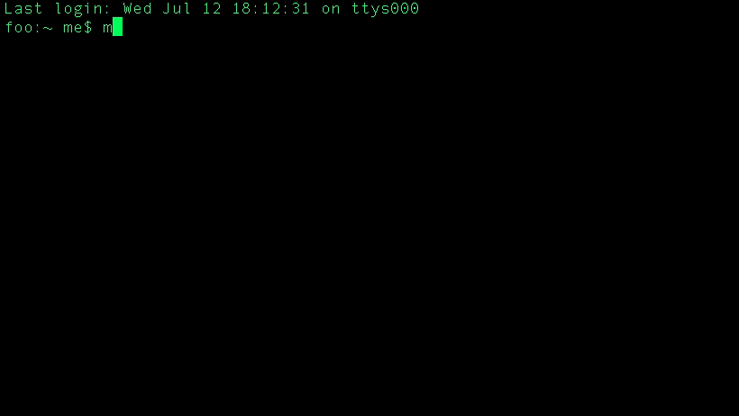

## Description
A mini c++ program simulating a chat bot for a trailer for a music venue. It was used as an ad for an event.
The original c++ project by ([DevonBernard/ASCII-Art](https://github.com/DevonBernard/ASCII-Art)) allows you to easily convert any plain-text into ASCII art and vice-versa. I re-used the functions ```ReadFont, find_characters, display, convertTextToASCII``` as well as the font.txt file und put them in a header file that is included in the main script (bot.cpp). 

## Usage
Since this is a C++ project you need to compile to generate an executable. My main function is in the script bot.cpp. You can compile using the Makefile: 
- Compile with command ```make```
- Execute with command ```./bot```
- Program repeatedly pauses waiting for console input. 

## Preview

